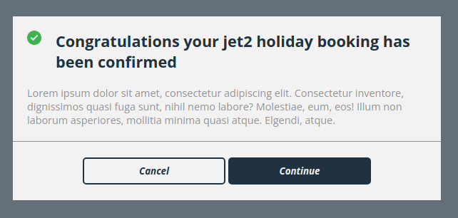
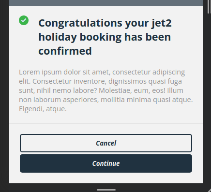

# Jet2 Tech Test

A techinical test created for the junior Front End Developer role at Jet2. Assignment was to create a mobile first responsive modal for confirming Jet2 holiday bookings.

## Table of Contents

1. [Live Preview](#live-preview)
2. [Dependencies](#dependencies)
3. [Setup](#setup)
4. [Available Scripts](#available-scripts)
5. [New Skills Learnt While Making This Project](#new-skills-learnt-while-making-this-project)
6. [What I Would Add If I Had More Time](#what-i-would-add-if-i-had-more-time)
7. [Attribution](#attribution)

## [Live Preview](https://perrybaran.github.io/jet-2-tech-test/)

## Dependencies

1. [React](https://reactjs.org/)
2. [SASS](https://sass-lang.com/)

### Dev Dependencies

1. [prettier](https://prettier.io/)
2. [gh-pages](https://www.npmjs.com/package/gh-pages)

## Setup

- Create a fork of this repo.
- Create a local clone of the repo: `git clone git@github.com:*your-github-username*/jet-2-tech-test`
- Install the project dependencies: `npm i`

## Available Scripts

### `npm start`

Run the app in development mode.\
Open [http://localhost:3000](http://localhost:3000) to view it in your browser.

### `npm run format`

Runs prettier on all files to format code.

### `npm run deploy`

Generates a production build of the app and deploys it to GitHub pages.

## New Skills Learnt While Making This Project

- First time using SASS and a CSS preprocessor in a project.
- Gained a deeper understanding of the BEM methodology.

## What I Would Add If I Had More Time

- Add unit tests to properly test the component.
- Changed how multiple modals are displayed. Either by making them spread out over the page as they're created or make them draggable so you can access multiple modals at once. Currently, each new modal just sits on top of the last.
- Used mixins to remove repetitive CSS code and make the styling more readable.

## Attribution

Created by **[Perry Baran](https://github.com/PerryBaran)**

Green tick icon by [Kiranshastry and Flaticon](https://www.flaticon.com/authors/kiranshastry)